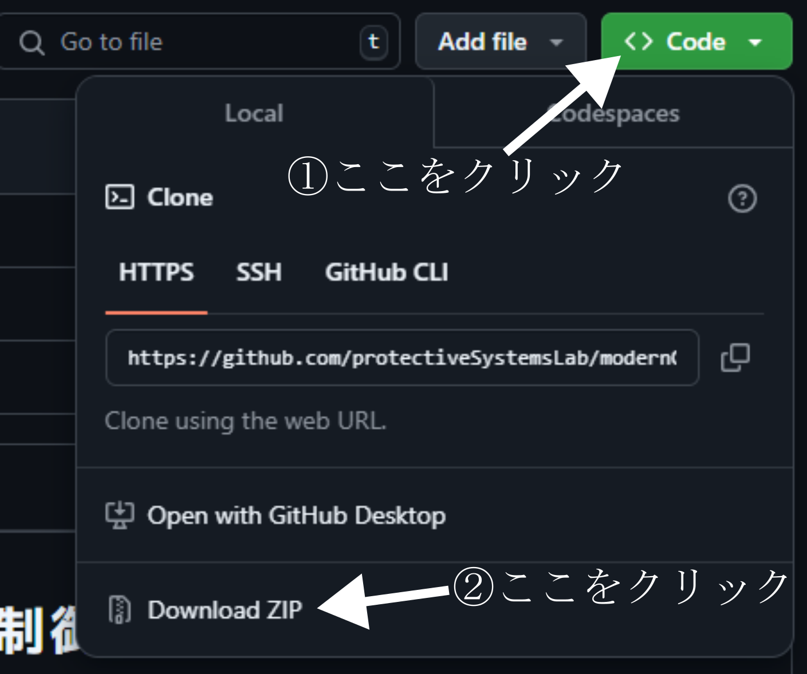

# 実践的に学ぶ建築構造物振動制御のための現代制御理論　プログラム集

## 1. はじめに
このレポジトリには，日本建築学会より2025年◯月に刊行された「実践的に学ぶ建築構造物振動制御のための現代制御理論」に掲載されたJulia プログラムを公開しています．

本レポジトリは，日本建築学会とは無関係な非公式のものです．

プログラムのダウンロードと利用は各自の責任において行って下さい．本レポジトリのプログラムの使用に伴ういかなる損害についても日本建築学会は責任を負いません．

## 2. プログラムのダウンロード方法
### 2.1. zip圧縮ファイルとしてダウンロードする方法
はじめに，下記リンクからgit レポジトリを開きます．
https://github.com/protectiveSystemsLab/modernControlTheory.git

①【<>Code▼】という緑色のボタンをクリックし，
②プルダウンメニューの　Download ZIP をクリックすると
圧縮ファイルがダウンロードできます．

自分のPCの任意のフォルダに解答してご利用下さい．

### 2.2. git clone による方法
任意のフォルダで
> git clone git@github:protectiveSystemsLab/modernControlTheory.git

としてレポジトリをクローンして下さい．
※レポジトリのクローンの意味が分からない方は2.1の方法でダウンロードして下さい．

## 3. フォルダの構成

フォルダの中には，
- Chapter3
- Chapter4
- Chapter5
   
の３つのフォルダがあります．
それぞれに，テキストの３，４，５章に掲載のプログラムが入っています．

## 4. ブログラムリスト

### Chpater4
- 4.6_impulseResopnse.jl：    Juilaを用いた単位衝撃応答の計算例 4.6節 p. 106, 
